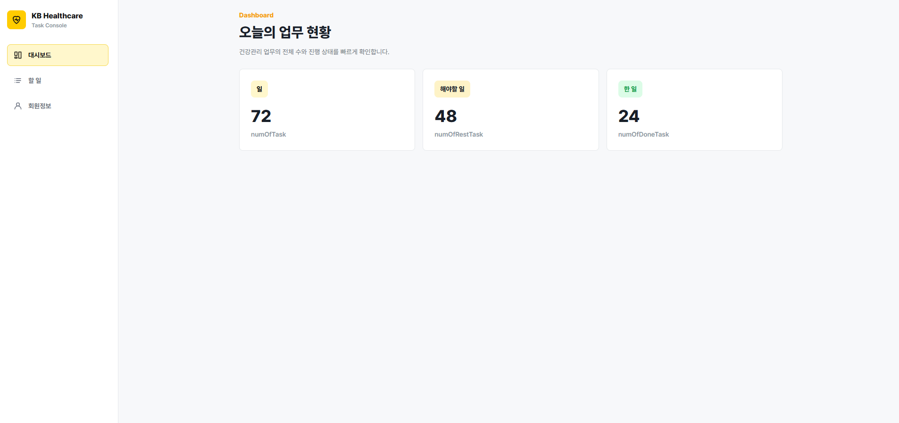
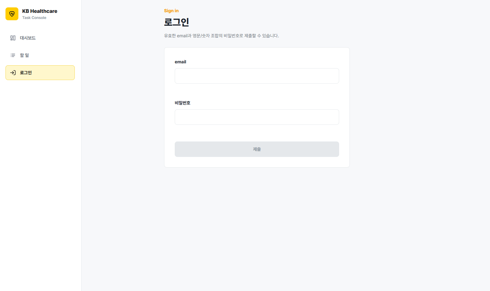
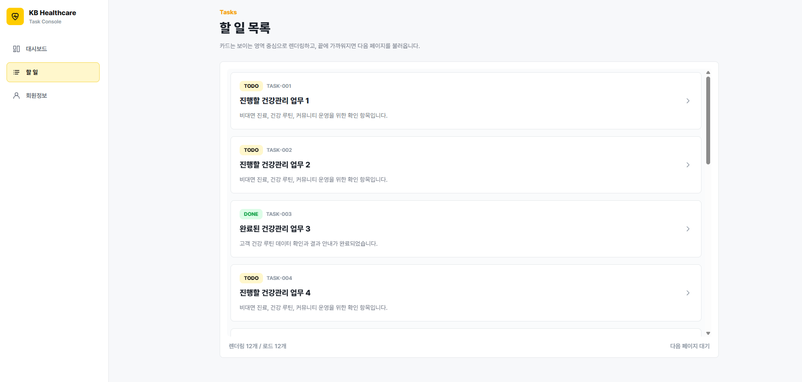
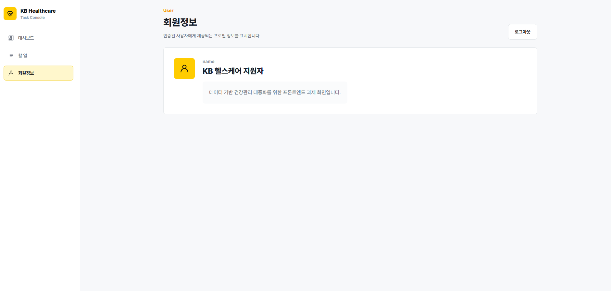

# KB Healthcare Frontend Assignment

`docs/requirement 1.md`와 `docs/openapi 1.yaml`을 기준으로 구현한 React/TypeScript 프론트엔드 과제입니다. 별도 API 서버 없이 함수 레벨 mock API로 인증, 대시보드, 할 일 목록/상세, 삭제, 회원정보 흐름을 확인할 수 있습니다.

## 개발 환경

- Node.js: v24.13.0
- npm: 11.6.2
- Package manager: npm (`package-lock.json` 기준)
- 주요 스택: React 19, TypeScript, Create React App, TailwindCSS
- 환경 변수: 별도 `.env` 파일 없음
- API 서버: 별도 서버 없이 `src/api/mockApi.ts`의 mock API 사용

## 실행 방법

```bash
npm install
npm start
```

- 개발 서버 기본 주소: `http://localhost:3000`
- 주요 라우트: `/`, `/sign-in`, `/task`, `/task/:id`, `/user`

## 빌드/테스트

```bash
npm run build
npm test -- --watchAll=false
```

작성 시점 검증 결과:

| 명령                           | 결과           |
| ------------------------------ | -------------- |
| `npm run build`                | 통과           |
| `npm test -- --watchAll=false` | 통과, 11 tests |

## 구현 요약

| 영역      | 구현 내용                                                                           |
| --------- | ----------------------------------------------------------------------------------- |
| 기술 스택 | React 19, TypeScript, CRA, TailwindCSS                                              |
| 라우팅    | 브라우저 History API 기반 자체 라우팅                                               |
| 화면 구조 | `pages`, `components`, `layout`, `auth`, `api`, `utils`로 역할 분리                 |
| 색상      | `src/utils/colors.ts`의 색상 토큰을 CSS 변수로 주입                                 |
| 폰트      | Pretendard CDN import 및 Tailwind fontFamily 적용                                   |
| API       | `src/api/mockApi.ts`에서 함수 레벨 mock 처리                                        |
| 인증      | access token, refresh token을 localStorage에 저장하고 401 발생 시 refresh 후 재시도 |
| 테스트    | 로그인, refresh, 목록, 404, 삭제 모달, 회원정보 렌더링 검증                         |

## 요구사항 충족 체크리스트

| 요구사항                                  | 구현 상태 | 구현 위치                                                      |
| ----------------------------------------- | --------- | -------------------------------------------------------------- |
| React@18/19 + TypeScript                  | 충족      | `package.json`, `src/**/*.tsx`                                 |
| 항목별 아이콘 표시                        | 충족      | `src/components/icons.tsx`, `src/layout/SideNavigation.tsx`    |
| 색상 토큰 관리                            | 충족      | `src/utils/colors.ts`, `src/components/ThemeStyle.tsx`         |
| Pretendard 폰트                           | 충족      | `src/index.css`, `tailwind.config.js`                          |
| GNB/LNB 라우트 맵                         | 충족      | `src/layout/SideNavigation.tsx`, `src/routes.ts`               |
| 로그인/회원정보 메뉴 전환                 | 충족      | `src/layout/SideNavigation.tsx`, `src/auth/useAuth.ts`         |
| 대시보드 수치 표시                        | 충족      | `src/pages/DashboardPage.tsx`, `src/api/mockApi.ts`            |
| 로그인 label/validation/errorMessage 모달 | 충족      | `src/pages/SignInPage.tsx`                                     |
| 할 일 목록 카드 표시                      | 충족      | `src/pages/TasksPage.tsx`, `src/components/tasks/TaskCard.tsx` |
| 가상 스크롤링                             | 충족      | `src/pages/TasksPage.tsx`                                      |
| 무한 스크롤                               | 충족      | `src/pages/TasksPage.tsx`, `src/api/mockApi.ts`                |
| 상세 페이지/404 화면                      | 충족      | `src/pages/TaskDetailPage.tsx`                                 |
| 삭제 확인 input 모달                      | 충족      | `src/pages/TaskDetailPage.tsx`                                 |
| 회원정보 표시                             | 충족      | `src/pages/UserPage.tsx`                                       |
| OpenAPI 기준 mock API                     | 충족      | `docs/openapi 1.yaml`, `src/api/mockApi.ts`, `src/types.ts`    |
| Agent AI 사용 문서                        | 충족      | `AI_USAGE.md`                                                  |

## 페이지별 구현 결과

### 대시보드 `/`

- `[GET] /api/dashboard` mock 결과로 `numOfTask`, `numOfRestTask`, `numOfDoneTask`를 표시합니다.
- 로그인하지 않은 상태에서는 인증 필요 화면을 표시합니다.



### 로그인 `/sign-in`

- `[POST] /api/sign-in` mock을 호출합니다.
- email label과 password label을 표시합니다.
- email 형식과 OpenAPI password 규칙(`^[A-Za-z0-9]+$`, 8~24자)을 검증합니다.
- 200이 아닌 응답은 `errorMessage`를 모달로 표시합니다.



### 할 일 목록 `/task`

- `[GET] /api/task?page=...` mock 결과를 카드 목록으로 표시합니다.
- 각 카드는 `title`, `memo`, `status`, `id`를 보여줍니다.
- `TASK_ITEM_HEIGHT`와 overscan 기준으로 화면에 필요한 카드만 렌더링합니다.
- 스크롤이 목록 끝에 가까워지면 `hasNext`를 확인하고 다음 페이지를 호출합니다.



### 할 일 상세 `/task/:id`

- `[GET] /api/task/{id}` mock 결과로 `title`, `memo`, `registerDatetime`을 표시합니다.
- 404 응답이면 목록으로 돌아갈 수 있는 화면을 표시합니다.
- 삭제 버튼을 제공합니다.


### 삭제 확인 모달

- 삭제 버튼 클릭 시 id 확인 input이 있는 모달을 표시합니다.
- input 값이 현재 task id와 같을 때만 `제출` 버튼이 활성화됩니다.
- 제출 시 `[DELETE] /api/task/{id}` mock을 호출하고 `/task`로 이동합니다.


### 회원정보 `/user`

- `[GET] /api/user` mock 결과로 `name`, `memo`를 표시합니다.
- 로그아웃 버튼으로 저장된 토큰을 제거하고 로그인 화면으로 이동합니다.



## API/mock 처리 방식

API 서버는 별도로 띄우지 않고 `src/api/mockApi.ts`에서 함수 레벨 mock으로 처리합니다.

| OpenAPI                 | mock 함수           | 구현 내용                                            |
| ----------------------- | ------------------- | ---------------------------------------------------- |
| `POST /api/sign-in`     | `api.signIn`        | email/password 검증 후 accessToken/refreshToken 발급 |
| `POST /api/refresh`     | `api.refreshToken`  | refreshToken 유효성 확인 후 토큰 재발급              |
| `GET /api/dashboard`    | `api.getDashboard`  | 현재 mock task 기준 업무 수 집계                     |
| `GET /api/task?page=`   | `api.getTasks`      | page 단위 목록과 `hasNext` 반환                      |
| `GET /api/task/{id}`    | `api.getTaskDetail` | 상세 데이터 또는 404 반환                            |
| `DELETE /api/task/{id}` | `api.deleteTask`    | mock task 제거 후 `{ success: true }` 반환           |
| `GET /api/user`         | `api.getUser`       | 사용자 `name`, `memo` 반환                           |

## 인증/refresh token 흐름

- 로그인 성공 시 `accessToken`, `refreshToken`을 localStorage에 저장합니다.
- 인증 API 요청은 `requestWithAuth`를 통해 수행합니다.
- access token이 없거나 인증 요청에서 401이 발생하면 `api.refreshToken`으로 token을 재발급한 뒤 요청을 한 번 재시도합니다.
- refresh token이 없거나 유효하지 않으면 저장된 토큰을 제거하고 인증 필요 상태로 돌아갑니다.
- OpenAPI의 refresh token cookie는 실제 서버가 없는 함수 mock 환경에서 localStorage 기반 입력으로 대체했습니다.

## 가상 스크롤/무한 스크롤

- 목록 컨테이너의 `scrollTop`과 고정 카드 높이(`TASK_ITEM_HEIGHT = 148`)를 기준으로 렌더링 범위를 계산합니다.
- `VIRTUAL_OVERSCAN = 4`를 적용해 보이는 영역 주변 카드까지 렌더링합니다.
- 스크롤이 하단에 가까워지면 `hasNext`가 true일 때 다음 page API를 호출합니다.

## 프로덕션과 다른 과제용 가정

아래 항목은 AI 사용 내역이 아니라, 과제 제출을 위해 실제 프로덕션 환경과 다르게 단순화한 구현 가정입니다.

| 구분 | 현재 구현/가정 | 프로덕션이라면 | 근거 파일 |
| --- | --- | --- | --- |
| API 서버 | 별도 서버 없이 함수 레벨 mock으로 OpenAPI 응답을 재현합니다. | 실제 API 서버와 HTTP client를 두고 네트워크 오류, 인증 헤더, 배포 환경별 base URL을 처리합니다. | `src/api/mockApi.ts`, `docs/requirement 1.md` |
| mock 데이터 | task, dashboard, user 데이터를 메모리 배열과 계산값으로 제공합니다. 삭제도 메모리 배열에서만 반영됩니다. | DB 또는 서버 상태를 기준으로 데이터를 조회/삭제하고, 새로고침 후에도 서버 상태가 유지됩니다. | `src/api/mockApi.ts` |
| token 형식 | 실제 JWT가 아니라 만료 시각을 담은 `mock-access-token`, `mock-refresh-token` 문자열을 사용합니다. | 인증 서버가 발급한 JWT 또는 opaque token을 사용하고 서명, 만료, 권한을 검증합니다. | `src/api/mockApi.ts`, `docs/openapi 1.yaml` |
| refresh token 저장/전달 | OpenAPI의 cookie 방식 대신 localStorage에 저장한 refreshToken을 mock 함수 인자로 전달합니다. | refresh token은 보통 HttpOnly/Secure/SameSite cookie로 보관하고 브라우저 요청에 credentials를 포함합니다. | `src/auth/tokenStorage.ts`, `src/auth/useAuth.ts`, `docs/openapi 1.yaml` |
| 라우팅 | 브라우저 History API를 사용하는 자체 라우팅으로 과제 범위의 경로를 처리합니다. | 라우트 규모, nested route, data loading, fallback 처리를 고려해 React Router 또는 프레임워크 라우팅을 사용할 수 있습니다. | `src/routes.ts`, `src/App.tsx` |
| 가상 스크롤 | 카드 높이를 `TASK_ITEM_HEIGHT = 148`로 고정 가정하고 렌더링 범위를 계산합니다. | 카드 높이가 동적으로 달라질 수 있으면 측정 기반 virtualizer 또는 검증된 라이브러리를 사용합니다. | `src/pages/TasksPage.tsx` |
| 테스트/결과 이미지 | 자동 테스트와 `public/results` 이미지는 mock API 기반 화면을 검증/증빙합니다. | staging/production API와 연결한 E2E, 시각 회귀, 접근성 검증을 별도로 수행합니다. | `src/App.test.tsx`, `public/results` |
| 폰트 로딩 | Pretendard를 CDN import로 불러옵니다. | 서비스 정책에 따라 self-hosting, preload, fallback 전략과 CDN 장애 대응을 설정합니다. | `src/index.css` |

## 제출/검증 참고

| 항목             | 내용                    |
| ---------------- | ----------------------- |
| 요구사항 문서    | `docs/requirement 1.md` |
| API 문서         | `docs/openapi 1.yaml`   |
| 화면 결과 이미지 | `public/results`        |
| AI 사용 문서     | `AI_USAGE.md`           |

## 수동 확인 권장 항목

- `/task`에서 실제 스크롤 끝 도달 시 다음 페이지가 이어서 로드되는지 확인
- `/task/:id` 삭제 모달에서 id 입력 후 제출 시 `/task`로 이동하는지 확인
- 새로고침 후 refresh token으로 인증 화면이 유지되는지 확인
- 모바일 viewport에서 GNB/LNB 아이콘과 로그인/회원정보 전환 확인
